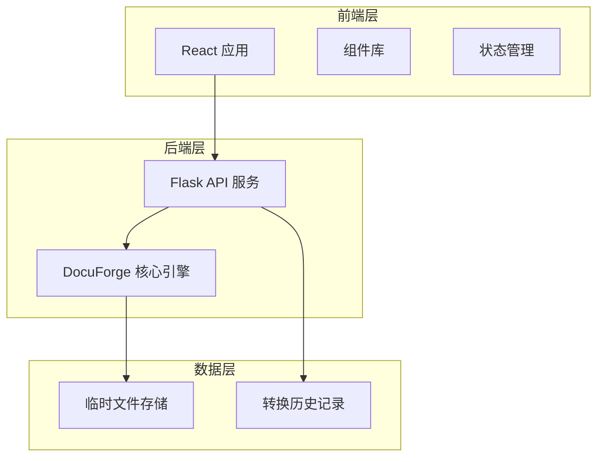
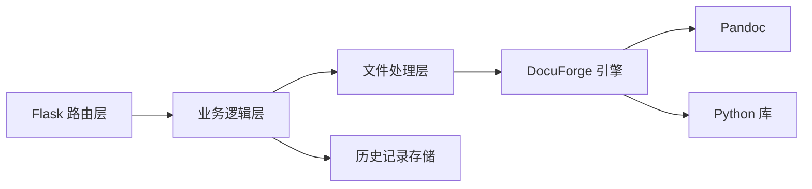
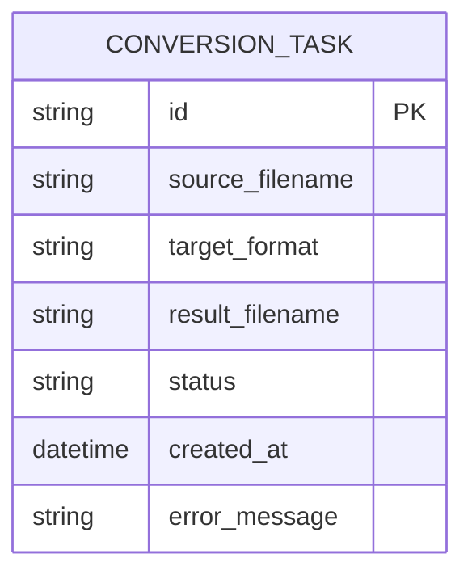

# DocuForge 前端技术架构文档

## 1. 架构设计



## 2. 技术说明

- **前端框架**：React 18 + TypeScript
- **构建工具**：Vite 5
- **样式方案**：Tailwind CSS 3
- **UI 组件**：自定义组件 + Lucide React 图标
- **HTTP 客户端**：Axios
- **后端框架**：Flask（轻量级 Python Web 框架）
- **后端依赖**：现有 DocuForge 核心引擎（converter.py）

## 3. 路由定义

| 路由 | 用途 |
|------|------|
| `/` | 首页 - 文件上传和转换主界面 |
| `/api/convert` | POST - 执行文件转换 |
| `/api/download/:filename` | GET - 下载转换后的文件 |
| `/api/history` | GET - 获取转换历史记录 |

## 4. API 定义

### 4.1 文件转换接口

```typescript
// 请求
POST /api/convert
Content-Type: multipart/form-data

{
  file: File,           // 上传的文件
  targetFormat: string  // 目标格式：'.docx' | '.pdf' | '.pptx' | '.md'
}

// 响应
{
  success: boolean,
  taskId: string,       // 任务 ID
  message: string
}

// 错误响应
{
  success: false,
  error: string,
  code: string
}
```

### 4.2 下载文件接口

```typescript
// 请求
GET /api/download/:filename

// 响应
Content-Type: application/octet-stream
Content-Disposition: attachment; filename="converted_file.docx"
```

### 4.3 历史记录接口

```typescript
// 请求
GET /api/history

// 响应
{
  success: boolean,
  data: Array<{
    id: string,
    sourceFile: string,
    targetFormat: string,
    resultFile: string,
    status: 'success' | 'failed',
    timestamp: string,
    error?: string
  }>
}
```

## 5. 服务器架构图



## 6. 数据模型

### 6.1 数据模型定义



### 6.2 数据定义语言

使用 JSON 文件存储转换历史（轻量级方案）：

```json
{
  "tasks": [
    {
      "id": "uuid-string",
      "source_filename": "document.md",
      "target_format": ".docx",
      "result_filename": "document.docx",
      "status": "success",
      "created_at": "2026-07-18T10:30:00Z",
      "error_message": null
    }
  ]
}
```

文件存储结构：
```
backend/
├── uploads/          # 上传的原始文件
├── outputs/          # 转换后的文件
└── history.json      # 转换历史记录
```
